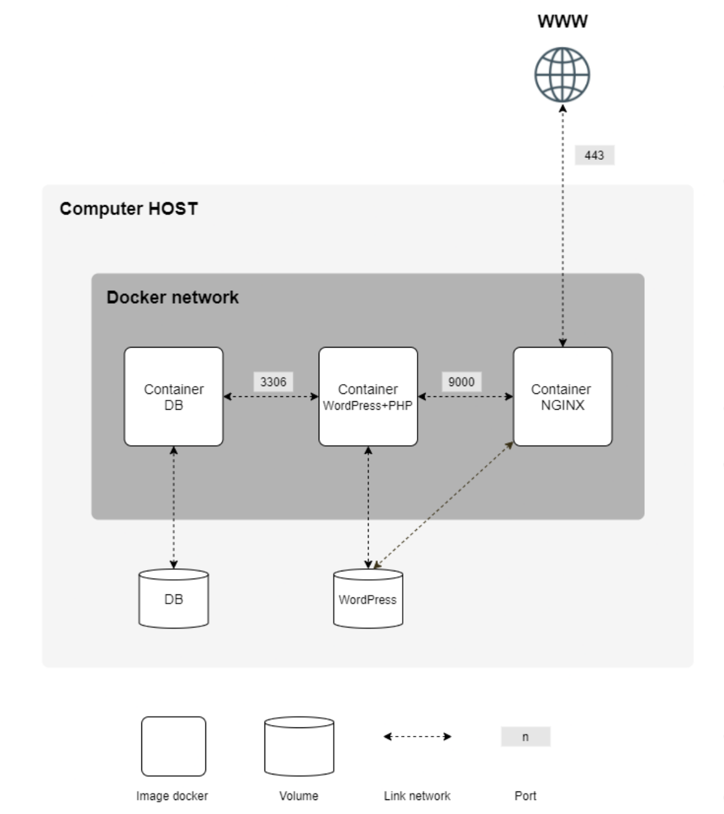

[](https://github.com/nfauconn/inception/blob/master/README.md)
[](https://github.com/nfauconn/inception/blob/master/README.fr.md)

*System Administration* • *Virtualization* • *Docker* • *Network Administration* • *Web* • *Security* • *Scripting* • *Alpine Linux*

# Inception

This project consists in setting up a small infrastructure composed of different services under specific rules:

**Containers**:
- A Docker container that contains **NGINX** with TLSv1.2 or TLSv1.3 only.
- A Docker container that contains **WordPress + php-fpm** (it must be installed and configured) only without Nginx.
- A Docker container that contains **MariaDB** only without Nginx.

**Volumes:**
- A volume that contains the **WordPress database**.
- A second volume that contains your **WordPress website files**.

**Network:**
- A docker-network that establishes the connection between your containers.

All Docker images are built from scratch using **Alpine Linux**, convenient for its small size, its rapidity and its security.



## Usage

```shell
git clone git@github.com:nfauconn/inception.git
cd inception
```

Then you can create a .env file by copying .env.example file and change the values as you want.
```
cp srcs/.env.example srcs/.env
```

> This project is configured to run on localhost (127.0.0.1). You'll need to configure the domain name you've chosen to point to your local IP address in your `/etc/hosts` file by adding at the end of the file:
> ```
> 127.0.0.1 <your domain name>
> ```

Finally, you can build the project with:

```shell
make
```

And access the WordPress website at the address you've chosen in your browser.